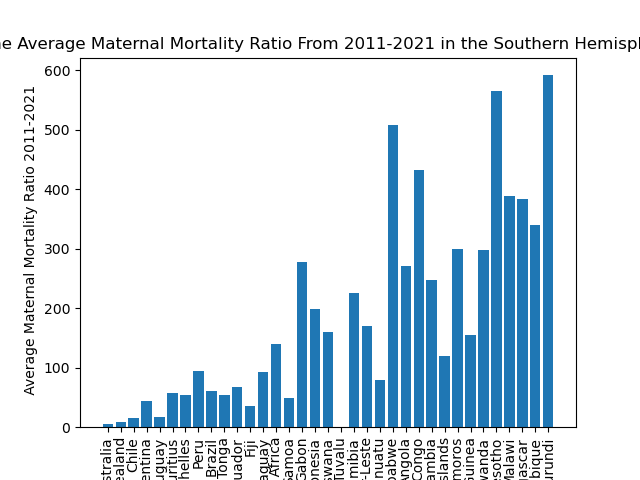
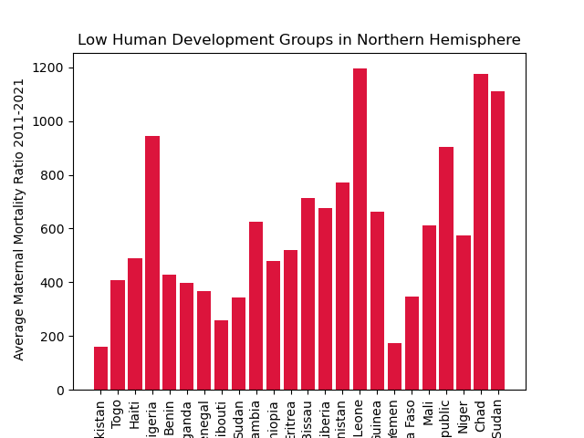

# Exploring the Human Development Index Attributes: Maternal Mortality and Gender Inequality from 1990 to 2021
## Team Members: Andrea Hernandez, Breona Lewis, Mark Mason, Daniela Trujillo

## Project Background
The goal of this ETL project is to explore Human Development Index (HDI) differences and trends from 1990 to 2021 by specifically focusing on maternal mortality rates and gender inequality data. 
The HDI looks at three dimensions of human development to measure their relative success in achieving a long healthy life, access to knowledge, and a quality standard of living. By assessing life expectancy, years of schooling and gross national income, this index informs governments on public policy and what changes can be made. Two attributes that factor in to understanding life expectancy are maternal mortality and gender inequality. As these two attributes decrease, a country's HDI rank will likely increase. 

## ETL
This project combined datasets on maternal mortality and gender inequality, as well as a HDI ranking (2021) spreadsheet, to understand the difference throughout world regions from 1990 to 2021. 
Polars Library to read in data in a jupyter notebook
Postgres SQL

# Dataset References:
Maternal Mortality: https://www.kaggle.com/datasets/iamsouravbanerjee/maternal-mortality-dataset
Gender Inequality: https://www.kaggle.com/datasets/iamsouravbanerjee/gender-inequality-index-dataset
HDI Rank 2021: https://hdr.undp.org/data-center/documentation-and-downloads